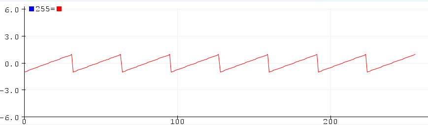

# Sensoren, Actuatoren en Filtering
***Qing Scholten***

1. Advanced RISC Machines

2. ARM Cortex-M4

3. Kloksnelheid 72 MHz en het intern geheugen is 64 kbytes

4.
```c
void setup(){
pinMode(3, OUTPUT);
}

void loop() {
  digitalWrite(3, HIGH);
  delay(1);
  digitalWrite(3, LOW);
  delay(1);
}
```

5. sample en 100. Sample is een functie die leest en 100 is het aantal microseconden van de interval tussen de verschillende aanroepen van de functie.

6. De minimale sampling periode $T_s$ is 10 microseconden gelijk aan 0.00001 seconden. De sampling frequency $f_s$ die hier bij hoort is $\frac{1}{T_s} = \frac{1}{0.00001}=100 000 Hz = 100 kHz$. Aangezien de minimale sampling time 0.00001 seconden is, is de maximale sampling frequency 100 kHz.

7. 

8. De periodetijd is ongeveer $T=50*100\mu s= 5000\mu s= 5 ms = 0.005 s$. De bijbehorende frequentie is $f = \frac{1}{0.005s} = 200 Hz$.

9. 
Op het plaatje is een grafiek van een sinusfunctie te zien. Bij een sample frequentie $f_s = 9000 Hz$ is de sampling periode $T_s=\frac{1}{9000}=0.00011s = 0.11ms$. In dit plaatje zijn is dus $256*0.00011=0.02816 s$ aan data te zien. De periodetijd te zien op het plaatje is $T = 33.3 samples = 33.3*0.00011s = 0.003663s$. Dus de frequentie $f = \frac{1}{0.003663}=273Hz$.

10. 
Het laat zien dat er een piek rond 10 ligt.

11. De piek ligt bij 8.

12. $f_s = 9000Hz$ met 256 samples is $\Delta f=\frac{9000}{256}=35.16Hz$. De piek is op 8, dus $f_piek=8*35.16Hz=281.28Hz$

13. 

Ik zie een blokgolf met acht pieken in het frequentiedomein bij 8, 24, 40, 56, 72, 88, 104 en 120 in aflopende volgorde.

14.  De basisfrequentie is $f_b = 33 samples$. De sample frequentie $f_s=20kHz=20000Hz$ geeft $T_s=\frac{1}{20000}=0.00005s$. De basisperiode is hiermee $T_b=33*0.00005=0.00165$. Hiermee is de basisfrequentie $f_b=\frac{1}{0.00165}=606.06 Hz$.

15. 

Een trapgolf.

16. 
Er wordt maar 43 keer gesampeld. Hierdoor loopt de grafiek na de 43e sampel recht door in plaats van in een blokvormgolf. 

17. Bij 256 is het hele tijdsdomein gevuld met blokgolven.

