# Sensoren, Actuatoren en Filtering
***Qing Scholten***

<script type="text/javascript" src="http://cdn.mathjax.org/mathjax/latest/MathJax.js?config=TeX-AMS-MML_HTMLorMML"></script>
<script type="text/x-mathjax-config">
  MathJax.Hub.Config({ tex2jax: {inlineMath: [['$', '$']]}, messageStyle: "none" });
</script>

1. $f_s = 9000 Hz$ en $N=256$. De hoogste frequentie die hier mee te meten is $f_{max}=\frac{f_s}{2} = \frac{9000}{2}=4500Hz$. De minimale frequentie die te meten is is $f_{min}=\frac{f_s}{N}=\frac{9000}{256}=35,15625$.

2. 
```arduino
  BeginMicro = micros();
  samples[sampleCounter] = (float32_t)analogRead(AUDIO_INPUT_PIN);
  EindMicro = micros();
  Serial.print(BeginMicro); Serial.print("-"); Serial.print(EindMicro); Serial.print("="); Serial.println(EindMicro-BeginMicro);
```

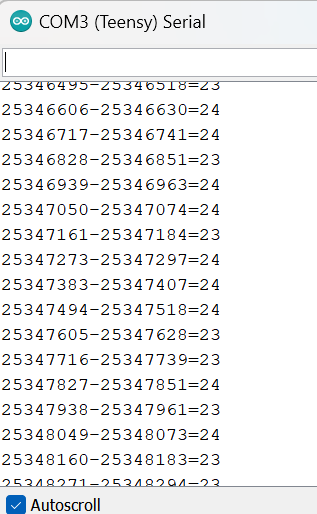
Een sample meting duurt 23 tot 24 microseconden.


3. Dit loopt niet knel want 23/24 microseconden is kleiner dan de periodetijd van een sampel wat $\frac{1}{9000}=111$ microseconden is. 

4. Er zit $T_s=111$ microseconden tussen twee samples.

5. Het duurt 29 microseconden = 0.029 miliseconden.
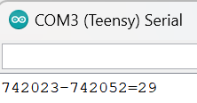
```arduino
  	BeginMicro = micros();
    for (int t=0; t<256; t++) timeDomainRaw[t]=samples[2*t]; // Copy the samples into TimeDomain as the FFT uses samples as output
    EindMicro = micros();
    Serial.print(BeginMicro); Serial.print("-"); Serial.print(EindMicro); Serial.print("="); Serial.println(EindMicro-BeginMicro);
```

6. De frequentie resolutie is $\Delta f = \frac{f_s}{N}=\frac{9000}{256}=35.15625Hz$

7.
TijdsdomeinRaw
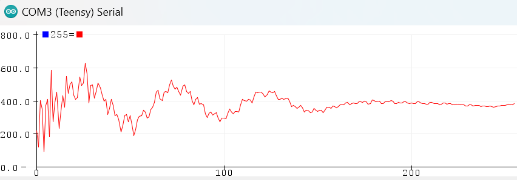

TijdsdomeinRev
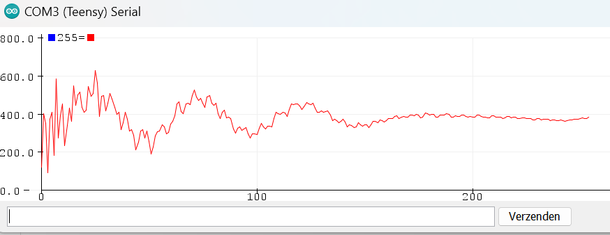

Frequentiedomein
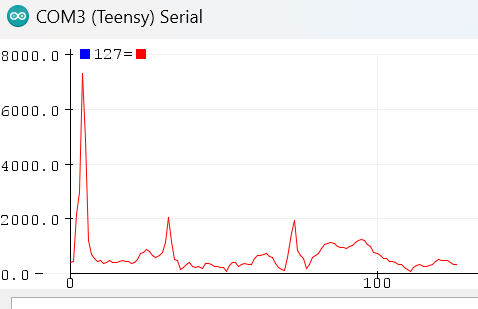

De eerste twee plaatjes zijn bijna hetzelfde. De TijdsdomeinRaw is de ruwe informatie die opgehaald is door de sensor afgezet tegen het tijdsdomein. De TijdsdomeinRev is gemaakt door middel van berekingen met de data uit het frequentiedomein. Hierdoor is de faseverschuiving in het ruwe beeld er uit. De eerste piek in de grafiek van het frequentiedomein is de draaggolf waar alle andere frequenties aan toegevoegd zijn om een signaal te krijgen.

8.
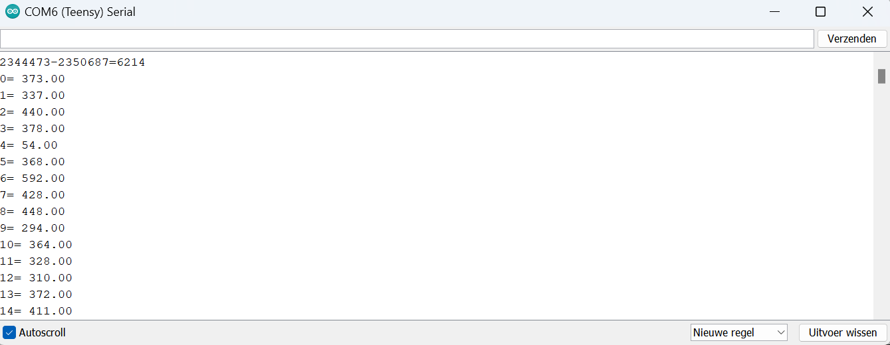

Het duurt 6214 microseconden.

```arduino
    BeginMicro = micros();
    arm_cfft_radix4_instance_f32 fft_inst;
    arm_cfft_radix4_init_f32(&fft_inst, FFT_SIZE, 0, 1);
    arm_cfft_radix4_f32(&fft_inst, samples);  // samples now contains the real and imaginairy part of the FFT
    EindMicro = micros();
    Serial.print(BeginMicro); Serial.print("-"); Serial.print(EindMicro); Serial.print("="); Serial.println(EindMicro-BeginMicro);
```

9. $T2 + T3 = 29 + 6214 = 6243$ microseconden dus dat is 6.243 miliseconden. Dus de vertragingstijd is 6.243 ms. In het artikel staat dat een vertraging tot 10 ms acceptabel is. Aangezien $10>6.243$ miliseconden, is deze vertraging acceptabel voor bijvoorbeeld een gehoorapparaat.

10.

```arduino
    //filter low-frequency noise
    for (int i = 1; i < 50; i++) {
      samples[i] = 0;
    }
    for (int i = 511; i < 511 - 50; i--) {
      samples[i] = 0;
    }
```

TimeDomeinRaw
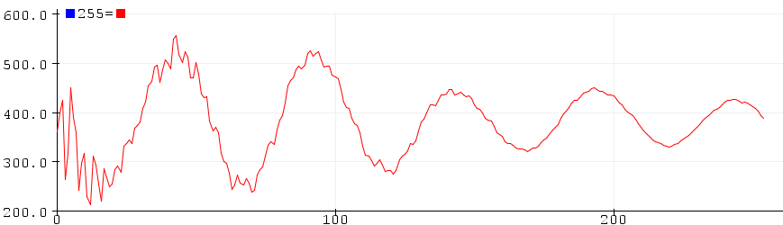

TimeDomeinRev
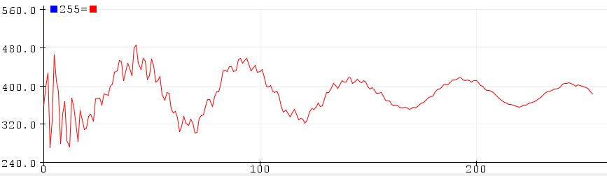

De noise is er uit gefiltert waardoor het signaal een mooiere sinus lijn laat zien.

11. 

Frequentiedomein
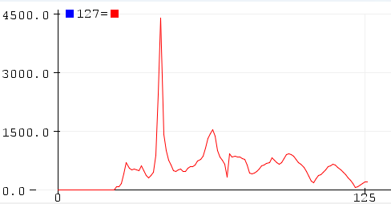

TimeDomeinRaw
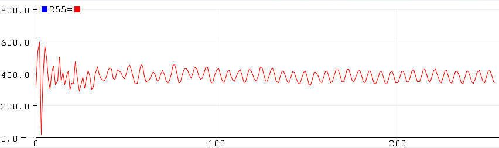

Er is een sinusvormig signaal te zien met de frequentie van de gegenereerde toon.

12.
De piek zit op waarde 43. $f_s = 9000 Hz$, samples is 256 dus $\Delta f=\frac{9000}{256}=35.16Hz$. Met de piek op 43 is $f_i = 43*35.16Hz=1511.88Hz$ Dit klopt met de uitgekozen frequentie van ongeveer 1500Hz.

13. 

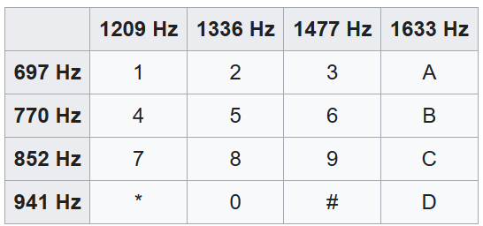

14. Done