# Sensoren, Actuatoren en Filtering
***Qing Scholten***

<script type="text/javascript" src="http://cdn.mathjax.org/mathjax/latest/MathJax.js?config=TeX-AMS-MML_HTMLorMML"></script>
<script type="text/x-mathjax-config">
  MathJax.Hub.Config({ tex2jax: {inlineMath: [['$', '$']]}, messageStyle: "none" });
</script>

1.

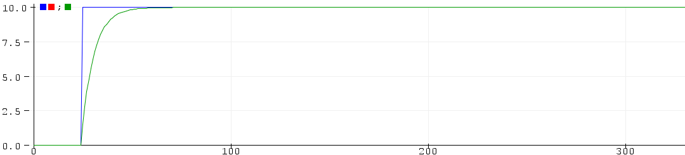
De blauwe lijn is het ingangssignaal en de groene lijn is het uitgangssignaal. Door de vorm van het uitgangssignaal is te zien dat het een laagdoorlaatfilter is.

2.

De differentievergelijking van het laagdoorlaatfilter is: 
$Y[n] = 0.15*X[n] + 0.85*Y[n-1]$

De differentievergelijking van het hoogdoorlaatfilter is:
$Y[n]=X[n]-X[n-1]+C*Y[n-1]$

3.

Onderstaande is de grafiek behorende bij het hoogdoorlaatfilter.
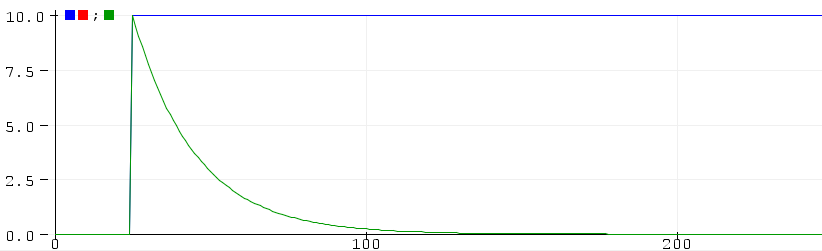
```arduino
float C = 0.95123;
Y[n] = X[n]-X[n-1]+C*Y[n-1];
```

4.

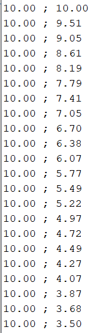

36.8% van de beginwaarde is $0.368*10 = 3.68$. 

Bij 20 is de waarde 36.8%. $\tau =  T * 20 = \frac{1}{f_s}*20=\frac{1}{10000}*20 = \frac{1}{500}$. Hierdoor is $f_c = \frac{1}{\tau}=\frac{1}{\frac{1}{500}}=500$. Dus de kantelfrequentie van dit filter is 500 Hz.

5.

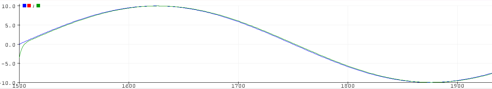
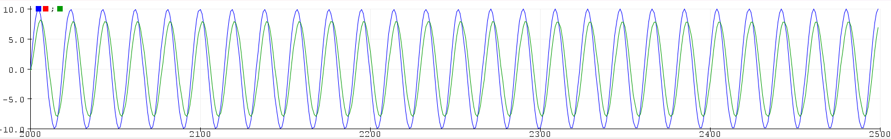
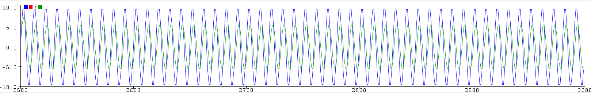

Het is karakteristiek van een laagdoorlaatfilter aangezien de groene lijn het meest correspondeert met de blauwe lijn bij de lage frequenties ten opzichte van de hoge frequenties. Hoe hoger de frequentie, hoe minder de blauwe lijn met de groene lijnt correspondeert, dus hoe meer het signaal gedempt wordt. Bij een lage frequentie, zie bovenste plaatje, ligt de groene lijn bijna op de blauwe lijn, terwijl met de hoogste frequentie, zie onderste plaatje, er een groot verschil tussen de lijnen is.

6.

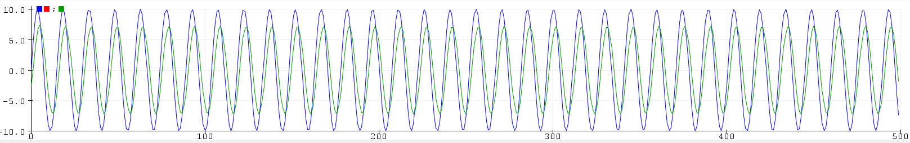

$X_{max}=10$ en $Y_{max} = 0.707*X_{max} = 0.707*10=7.07$ zoals te zien is op de afbeelding. Er worden in totaal 500 samples genomen en daarin zijn ongeveer 34 golven te zien. Dit betekent dat er per golf ongeveer $500/34=14.71$ samples zijn. Dit betekent dat met een sampletijd van $T_s = \frac{1}{f_s}=\frac{1}{10000} = 0.0001s$ een golf tijd  $T_{golf}=0.0001*14.71=0.001471s$ is. Dus de frequentie is $f_c = \frac{1}{T_{golf}} = \frac{1}{0.001471} = 679.81$ Hz.

7.

Het uitgangssignaal Yn loopt achter op het ingangssignaal Xn.

8.

Dit is de karakteristiek van een hoogdoorlaatfilter. Hierbij worden de lage frequenties gedempt, zoals te zien is in de onderstaande grafieken.

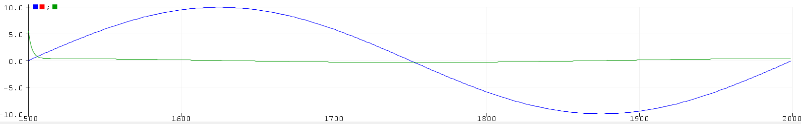
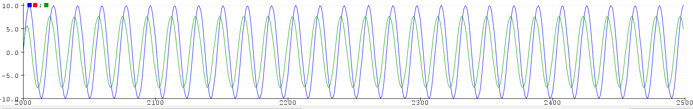
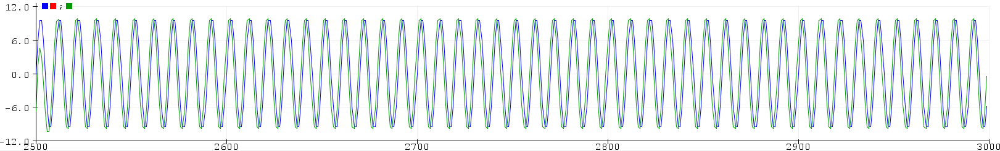

9.

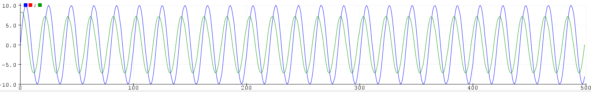

Er worden in totaal 500 samples genomen en daarin zijn ongeveer 25 golven te zien. Dit betekent dat er per golf ongeveer $500/25=20$ samples zijn. Dit betekent dat de sampletijd van $T_s=\frac{1}{f_s}=\frac{1}{10000} = 0.0001s$ een golf tijd $T_{golf} = 0.0001 * 20 = 0.002s$ is. Dus de frequentie is $f_c = \frac{1}{T_{golf}} = \frac{1}{0.002} = 500$ Hz.

10.

Het uitgangssignaal loopt achter op het ingangssignaal.

11. 

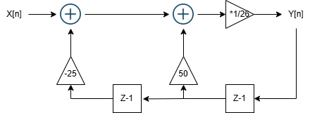

12.

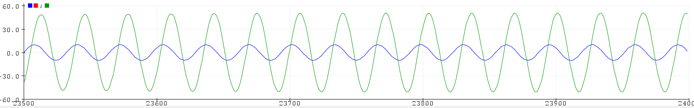

Ymax is 51. Er zijn in totaal 500 samples genomen. Daarin zijn ongeveer 15 golven te zien. Dit betekent dat er per golf ongeveer $500/15=33.3$ samples zijn. Dit betekent dat de tijd per golf $T_{golf} = 0.0001*33.3 = 0.00333s$ is. Dus de frequentie is $f = \frac{1}{T_{golf}} = \frac{1}{0.00333} = 300$ Hz.

13.

Er worden 500 samples genomen. De sampling frequentie is 10000. De maximale frequentie is dus $\frac{10000}{2} = 5000$ Hz. De minimale frequentie is $\frac{10000}{500}=20$ Hz.
De piek ligt op 156. Dit is frequentie $20 * 156 = 3120$ Hz.

14.

$Ymin0 = \frac{Xmin0 + 50*Ymin1 - 25*Ymin2}{26}$
Bij een hoge frequentie benadert het de 0 en wordt het signaal onderdrukt.
Bij een lage frequentie wordt het signaal versterkt. 
Rond 150 is er een piek en daarna lijkt er signaal onderdrukking te ontstaan.
Het lijkt een laagdoorlaatfilter te zijn. 

15.

Het lijkt een laagdoorlaatfilter te zijn.

16.

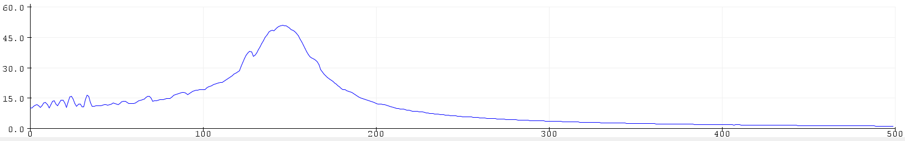

Te zien is dat er bij lage frequenties het signaal volledig door komt met een piek rond de 150. Bij hoge frequenties wordt het signaal onderdrukt waardoor het de 0 benadert.

17.

y[n] = (x[n] + a * x[n-1] + b * x[n-2]) * C + d * y[n-1] + e * y[n-2]

18.

Het minimum ligt rond 380. Dus de frequentie is $380 * 20=7600$ Hz.

19.

Voor alle frequenties is het 10, behalve voor rond 7600, daar loopt het naar 0.

20.

Het is een bandstopfilter.

21.

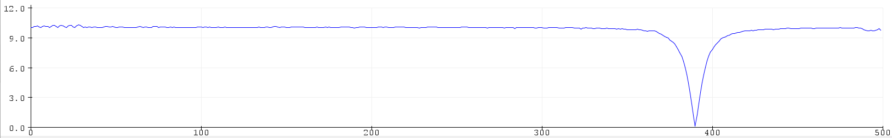

22.

Tussen de 1 en 2 micro seconden.

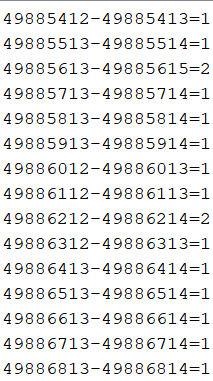

```arduino
/*  Teensy digtal filter 2
 *  Author: J. van den Helder
 *  Date 9 maart 2021
 *  Audio Notch filter
 */

#define LED1 11
#define LED2 12
#define LED3 13
#define LED4 14
#define AUDIO_INPUT_PIN 23        // Input ADC pin for audio data. (A9)
unsigned long BeginMicro = 0;
unsigned long EindMicro = 0;

IntervalTimer timer;
void sample();
int Xmin2, Xmin1, Xmin0;
float Ymin2, Ymin1, Ymin0;
float Ymax = 0;

void setup() {
  pinMode(LED1, OUTPUT); pinMode(LED2, OUTPUT); pinMode(LED3, OUTPUT); pinMode(LED4, OUTPUT);
  pinMode(AUDIO_INPUT_PIN, INPUT);
  Serial.begin(38400);
  timer.begin(sample, 100);
}

void loop() {
  digitalWrite(LED1, LOW); digitalWrite(LED2, LOW); digitalWrite(LED3, LOW); digitalWrite(LED4, LOW);
  if (Ymax>400)  digitalWrite(LED1, HIGH);
  if (Ymax>435)  digitalWrite(LED2, HIGH);
  if (Ymax>470)  digitalWrite(LED3, HIGH);
  if (Ymax>500)  digitalWrite(LED4, HIGH);
  delay(100);
  Ymax = 0.9*Ymax;
}

void sample () {
  Xmin2 = Xmin1; Xmin1 = Xmin0;
  Xmin0 = analogRead(AUDIO_INPUT_PIN);
  Ymin2 = Ymin1; Ymin1 = Ymin0;
  // Begin Digitale filter 
  BeginMicro = micros();
  Ymin0 = Xmin0;
  EindMicro = micros();
  Serial.print(BeginMicro); Serial.print("-"); Serial.print(EindMicro); Serial.print("="); Serial.println(EindMicro-BeginMicro);
  // Eind digitale filter
  if (Ymin0 > Ymax) Ymax = Ymin0;
}
```

23.

Bij 800 Hz.